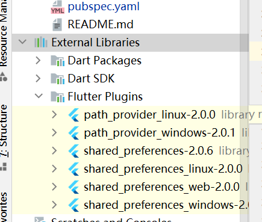

## 实验3
引入shared_preferences,向pubspec.yaml文件中添加依赖，之后点击pub get引入，在左边的external libraries/Flutter Plugins 中检查是否引入，之后get dependencies
```bash
dependencies:
  shared_preferences: ^2.0.6
```



### 1. 首先实现自动登录功能
#### 1.1 创建数据结构
为了实现我们的自动登录功能，则需要将数据持久化到磁盘中，因此在loginPage中创建一个_pres.
```dart
//获取，将数据持久化到磁盘中
Future<SharedPreferences> _pres = SharedPreferences.getInstance();
```

#### 1.2 提交时保存账户密码
接下来将账户密码保存至配置文件中，由于_pres是Future类型，需要将其加载完成。
```dart
// 加载
final pres = await _pres;
```
之后选用一个通用的类来存储账户的用户名和密码。(由于其他类需要使用，因而重新设计一个类)
```dart
<!-- 新建User类 -->
class User {
  static const String accountKey = "account_key";
  static const String passwordKey = "password_Key";
}
```

存储到配置文件中。虽然是future类型，但是实际情况并不需要等待存储完成才能跳转页面，因而不需要添加await。
```dart
// 向配置文件中填入
final pres = await _pres;
pres.setString(User.accountKey, accountController.text);
pres.setString(User.passwordKey, pwdController.text);
```
此时写入已经搞定了，那么我们需要在进来的时候将其初始化掉。最开始进入的时候我们是没有数据的，那么在登录之后，我们的配置文件中是有数据的了，因而在initState处，我们要将其读取出来。(初始化状态时不要使用异步操作，时间不超过18ms)
由于我们不能等待但是又必须调用异步函数，使用Future中的then方法.
```dart
Future future = new Future(() => null);
future.then((异步操作逻辑写在这里);
```
在这里我们不用异步，不需要等待了但是我们使用了回调。之后在这里获取我们的账户密码并将其填入Controller中。
```dart
 @override
  void initState() {
    _pres.then((d) {
      accountController.text = d.getString(User.accountKey);
      pwdController.text = d.getString(User.passwordKey);
      _checkUserInput();
    });
    super.initState();
```
### 2.显示系统内的文件
给系统一个路径，显示系统内的文件

文件类的封装
添加path_provider依赖
将系统的files对象转化为DiskFile显示出来，新建一个类SystemFile，把系统的描述一个文件(夹)的类转化为可以在系统上显示的类。
```dart
//访问DiskFile内的东西，完成命名构造函数
class SystemFile extends DiskFile {
  SystemFile.fromSystem(FileSystemEntity file) {
    //同步获取到文件状态，获得其修改时间，同步文件夹
    FileStat fileStat = file.statSync();
    int timestamp = fileStat.modified.toLocal().millisecondsSinceEpoch ~/ 1000;
    int isDir = FileSystemEntity.isDirectorySync(file.path) == true ? 1 : 0;
    super.path = file.path;
    super.serverFilename = file.path.substring(file.parent.path.length + 1);
    super.serverCtime = timestamp;
    super.size = fileStat.size;
    super.isDir = isDir;
  }
}
```
抽象成接口，FileStore
1.listFiles:返回DiskFile，获取文件列表.